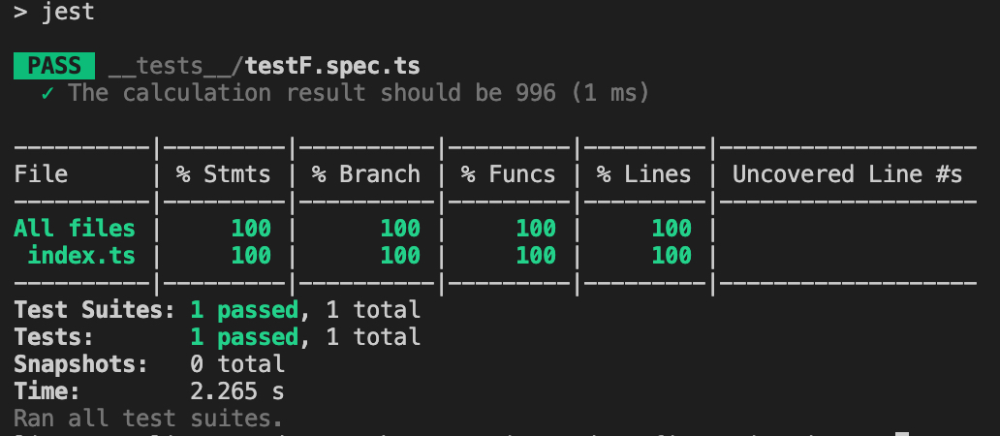
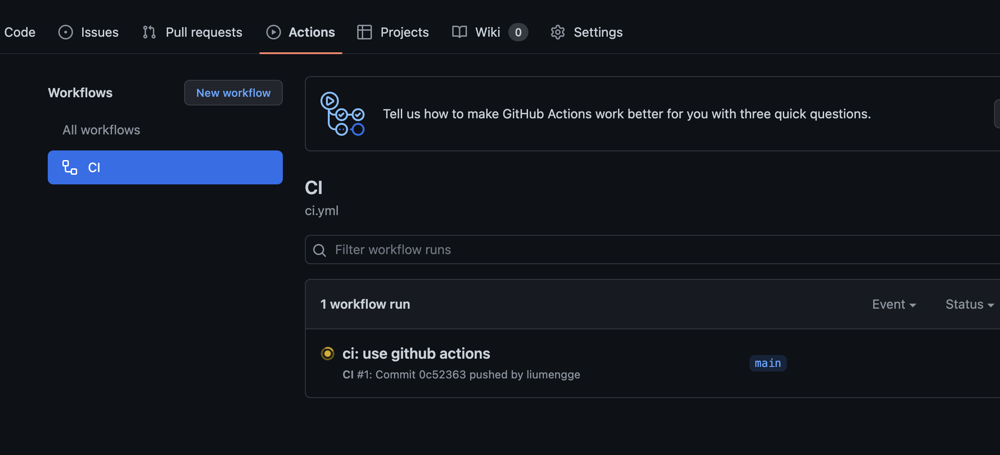
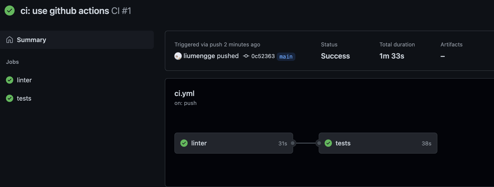
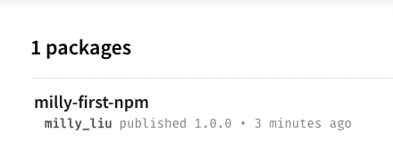

# engineered-configuration-demo

macOS
node -v  => 14.18.1
## tsconfig.json配置

```json
{
  "compilerOptions": {
    /* Basic Options */
    "baseUrl": ".", // 模块解析根路径，默认为 tsconfig.json 位于的目录
    "rootDir": "src", // 编译解析根路径，默认为 tsconfig.json 位于的目录
    "target": "ESNEXT", // 指定输出 ECMAScript 版本，默认为 es5
    "module": "ESNext", // 指定输出模块规范，默认为 Commonjs
    "lib": ["ESNext", "DOM"], // 编译需要包含的 API，默认为 target 的默认值
    "outDir": "dist", // 编译输出文件夹路径，默认为源文件同级目录
    "sourceMap": true, // 启用 sourceMap，默认为 false
    "declaration": true, // 生成 .d.ts 类型文件，默认为 false
    "declarationDir": "dist/types", // .d.ts 类型文件的输出目录，默认为 outDir 目录
    /* Strict Type-Checking Options */
    "strict": true, // 启用所有严格的类型检查选项，默认为 true
    "esModuleInterop": true, // 通过为导入内容创建命名空间，实现 CommonJS 和 ES 模块之间的互操作性，默认为 true
    "skipLibCheck": true, // 跳过导入第三方 lib 声明文件的类型检查，默认为 true
    "forceConsistentCasingInFileNames": true, // 强制在文件名中使用一致的大小写，默认为 true
    "moduleResolution": "Node", // 指定使用哪种模块解析策略，默认为 Classic
  },
  "include": ["src"] // 指定需要编译文件，默认当前目录下除了 exclude 之外的所有.ts, .d.ts,.tsx 文件
}
```

## package.json配置

```json
{
  "main": "dist/index.js",
  "types": "dist/types/index.d.ts", // 指定编译生成的类型文件，如果 compilerOptions.declarationDir 指定的是 dist，也就是源码和 .d.ts 同级，那么types可以省略
  "type": "module",
  "scripts": {
    "dev": "tsc --watch",
    "clean": "rm -rf dist",
    "build": "npm run clean && tsc"
  },
  "publishConfig": {
    "access": "public"
  },
}
```

测试：
index.ts:
```js
const testF = (a: number, b:number) => {
  return a - b
}

console.log(testF(1024, 28))
```

执行：npm run build && node dist/index.js

预期结果：在 dist 目录中生成 types/index.d.ts、index.js、index.js.map，并打印 996

## Eslint & Prettier

> 使用 Prettier 解决代码格式问题，使用 linters 解决代码质量问题

> prettier-vscode 和 eslint-vscode 冲突，如何 prettier 和 eslint 集成？

## Eslint

```
npm i eslint -D
npx eslint --init  // 利用 eslint 的命令行工具生成基本配置
```
一路按照提示安装：
```
✔ How would you like to use ESLint? · problems
✔ What type of modules does your project use? · esm
✔ Which framework does your project use? · vue
✔ Does your project use TypeScript? · No / Yes
✔ Where does your code run? · browser
✔ What format do you want your config file to be in? · JavaScript
The config that you've selected requires the following dependencies:

eslint-plugin-vue@latest @typescript-eslint/eslint-plugin@latest @typescript-eslint/parser@latest
✔ Would you like to install them now? · No / Yes
✔ Which package manager do you want to use? · npm
```

.eslintrc.cjs文件：
```js
module.exports = {
  "env": {
    "browser": true,
    "es2021": true,
    "node": true
  },
  "extends": [
    "eslint:recommended",
    "plugin:vue/vue3-essential",
    "plugin:@typescript-eslint/recommended"
  ],
  "parserOptions": {
    "ecmaVersion": "latest",
    "parser": "@typescript-eslint/parser",
    "sourceType": "module"
  },
  "plugins": [
    "vue",
    "@typescript-eslint"
  ],
  "rules": {
  }
}
```

为什么生成的配置文件名称是.eslintrc.cjs而不是.eslintrc.js？

因为将项目定义为ESM，`eslit --init`会自动识别 type，并生成兼容的配置文件名称，如果我们改回 .js 结尾，再运行 eslint 将会报错。出现这个问题是eslint内部使用了 `require()` 语法读取配置。这个问题也适用于其他功能的配置，比如后面的 Prettier、Commitlint等，配置文件都不能以 xx.js 结尾，而要改为当前库支持的其他配置文件格式，如：.xxrc、.xxrc.json、.xxrc.yml。

验证配置是否生效：
```js
const testF = (a: number, b:number) => {
  return a - b
}

// console.log(testF(1024, 28))
```

package.json:
```json
"scripts": {
  "dev": "tsc --watch",
  "clean": "rm -rf dist",
  "build": "npm run clean && tsc",
  "lint": "eslint src --ext .js,.ts --cache --fix"
},
```

执行`npm run lint`：
```
/Users/liumengge/Desktop/learn&share/engineered-configuration-demo/src/index.ts
  1:7  warning  'testF' is assigned a value but never used  @typescript-eslint/no-unused-vars

✖ 1 problem (0 errors, 1 warning)
```

校验成功。

因为是 Typescript 项目所以要添加 Standard 规范提供的 TypeScrip 扩展配置

`npm i eslint-config-standard-with-typescript -D`

npm run lint 后提示一样。
未生效。。。

## Prettier

> 把 prettier 集成到 eslint 的校验中

```
npm i prettier -D
echo {}> .prettierrc.json
```

.prettierrc.json: 只需要添加和所选规范冲突的部分
```
{
  "semi": false, // 是否使用分号
  "singleQuote": true, // 使用单引号代替双引号
  "trailingComma": "none" // 多行时尽可能使用逗号结尾
}
```

安装解决冲突需要的2个依赖：

eslint-config-prettier 关闭可能与 prettier 冲突的规则
eslint-plugin-prettier 使用 prettier 代替 eslint 格式化

`npm i eslint-config-prettier eslint-plugin-prettier -D`

.eslintrc.cjs:
```js
module.exports = {
  "env": {
    "browser": true,
    "es2021": true,
    "node": true
  },
  "extends": [
    "eslint:recommended",
    "plugin:vue/vue3-essential",
    "plugin:@typescript-eslint/recommended",
    "prettier"
  ],
  "parserOptions": {
    "ecmaVersion": "latest",
    "parser": "@typescript-eslint/parser",
    "sourceType": "module",
    "project": "./tsconfig.json"
  },
  "plugins": [
    "vue",
    "@typescript-eslint",
    "prettier"
  ],
  "rules": {
    "prettier/prettier": "error"
  }
}
```

验证配置是否成功 ？

`npm run lint`：无报错，保持一致。

## Husky

Husky是干嘛的？

一个项目通常是团队合作，不能保证每个人在提交代码之前执行一遍 lint 校验，所以需要 git hooks 来自动化校验的过程，否则禁止提交

安装：
```
npm i husky -D
npx husky install
```

生成 .husky 目录。在每次执行npm install时自动启用 husky。

package.json中添加：
```json
"scripts": {
  "dev": "tsc --watch",
  "clean": "rm -rf dist",
  "build": "npm run clean && tsc",
  "lint": "eslint src --ext .js,.ts --cache --fix",
  "prepare": "husky install"
}
```

添加一个 lint 钩子：
`npx husky add .husky/pre-commit "npm run lint"`

也可以直接在 .husky/pre-commit 文件中写入如下内容：
```sh
#!/usr/bin/env sh
. "$(dirname -- "$0")/_/husky.sh"

npm run lint
```

测试是否生效：

修改 index.ts 文件内容：
```js
const testF = (a: number, b: number): number => {
  return a - b
}

// console.log(testF(1024, 28))
```

执行 commit：
```
git add .
git commit -m 'test husky'
```

```
/Users/liumengge/Desktop/learn&share/engineered-configuration-demo/src/index.ts
  1:7  warning  'testF' is assigned a value but never used  @typescript-eslint/no-unused-vars

✖ 1 problem (0 errors, 1 warning)
```
warning，可以commit的。。。

如何可以调整为error？修改下 eslintrc.cjs 规则：
```json
"rules": {
  "prettier/prettier": "error",
  "@typescript-eslint/no-unused-vars": ["error"]
}
```

```
/Users/liumengge/Desktop/learn&share/engineered-configuration-demo/src/index.ts
  1:7  error  'testF' is assigned a value but never used  @typescript-eslint/no-unused-vars

✖ 1 problem (1 error, 0 warnings)
```

现在控制台提示的是error而不是warning。再重试下commit，此时会有error提示在控制台并拦截掉commit。

## Commitlint

为啥需要 Commitlint ？

> 有利于在生成 changelog 文件和语义发版中需要提取 commit 中的信息；利于其他同学分析你提交的代码

安装 Commitlint

- `@commitlint/config-conventional`：
- `@commitlint/cli`：Commitlint 命令行工具


`npm i @commitlint/config-conventional @commitlint/cli -D`

将 commitlint 添加到钩子：
`npx husky add .husky/commit-msg 'npx --no-install commitlint --edit "$1"'`

创建 `.commitlintrc` ：

```
{
  "extends": [
    "@commitlint/config-conventional"
  ]
}
```

测试钩子是否生效，index.ts:
```js
const testF = (a: number, b: number) => {
  return a - b
}

console.log(testF(1024, 28))
```

后台系统开发commit规范并没有被引入进来，当前完成需求commit的信息是根据个人喜好来的。比如：
```sh
git add .
git commit -m 'add eslint and commitlint'
```

规范：
```sh
git commit -m 'ci: add eslint and commitlint'
```

ci是啥？Angular 规范
- feat：新功能
- fix：修补 BUG
- docs：修改文档，比如 README, CHANGELOG, CONTRIBUTE 等等
- style：不改变代码逻辑 (仅仅修改了空格、格式缩进、逗号等等)
- refactor：重构（既不修复错误也不添加功能）
- perf：优化相关，比如提升性能、体验
- test：增加测试，包括单元测试、集成测试等
- build：构建系统或外部依赖项的更改
- ci：自动化流程配置或脚本修改
- chore：非 src 和 test 的修改，发布版本等
- revert：恢复先前的提交


## Jest

> 测试覆盖率100%！

安装 jest 和 类型声明 @types/jest ，其执行需要 ts-node 和 ts-jest 

ts-node 版本：v9.1.1？

`npm i jest @types/jest ts-node ts-jest -D`

初始化配置文件`npx jest --init`

```
✔ Would you like to use Jest when running "test" script in "package.json"? … yes
✔ Would you like to use Typescript for the configuration file? … yes
✔ Choose the test environment that will be used for testing › node
✔ Do you want Jest to add coverage reports? … yes
✔ Which provider should be used to instrument code for coverage? › babel
✔ Automatically clear mock calls, instances, contexts and results before every test? … yes
```

package.json:
```json
"scripts": {
  "dev": "tsc --watch",
  "clean": "rm -rf dist",
  "build": "npm run clean && tsc",
  "lint": "eslint src --ext .js,.ts --cache --fix",
  "prepare": "husky install",
  "test": "jest"
},
```

修改生成的 jest.config.ts 文件：
```js
{
  preset: 'ts-jest'
}
```

创建测试目录 `__tests__` 和 测试文件 `__tests__/testF.spec.ts`。

index.ts:
```js
const testF = (a: number, b: number) => {
  return a - b
}

export default testF
```

testF.spec.ts 文件中写入测试代码：
```js
import testF from '../src'

test('The calculation result should be 996', () => {
  expect(testF(1024, 28)).toBe(996)
})
```
控制台执行`npm run test`测试配置是否生效：



执行完后会生成一个coverage目录，其中包含的就是测试报告。

给 `__test__` 目录也加上 lint 校验。修改package.json：

```js
"lint": "eslint src __tests__ --ext .js,.ts --cache --fix",
```

此时，直接执行 `npm run lint` 将会报错，提示 `__tests__` 文件夹没有包含在 `tsconfig.json` 的 `include` 中，当添加到include之后，输出的dist中就会包含测试相关的文件，这并不是想要的效果。使用typescript-eslint官方给出的解决方案：

新建一个tsconfig.eslint.json文件：
```json
{
  "extends": "./tsconfig.json",
  "include": ["**/*.ts", "**/*.js"]
}
```

.eslintrc.cjs：
```js
"project": "./tsconfig.eslint.json"
```

验证配置是否生效：

```
git add .
git commit -m 'test: add unit test'
```

## Gihub Actions

> 通过Github Actions实现代码合并或推送到主分支，dependabot机器人升级依赖等动作，会自动触发测试和发布版本等一系列流程

### 代码自动测试

项目根目录创建 `.github/workflows/ci.yml` 及 `.github/workflows/cd.yml`，

ci.yml: 持续集成
```yml
name: CI

on:
  push:
    branches:
      - '**'
  pull_request:
    branches:
      - '**'
jobs:
  linter:
    runs-on: ubuntu-latest
    steps:
      - uses: actions/checkout@v2
      - uses: actions/setup-node@v2
        with:
          node-version: 16
      - run: npm ci
      - run: npm run lint
  tests:
    needs: linter
    runs-on: ubuntu-latest
    steps:
      - uses: actions/checkout@v2
      - uses: actions/setup-node@v2
        with:
          node-version: 16
      - run: npm ci
      - run: npm run test
```
监听所有分支的 push 和 pull_request 动作，自动执行 linter 和tests 任务。

测试配置是否生效：

```
git add .
git commit -m 'ci: use github actions'
git push
```

在项目的 github 的 Actions 可以看到对应的工作流程：




以上完成了代码自动 lint 和 测试 流程，如何实现自动发布？

### 代码自动发布

1. NPM 注册账号
2. 创建一个package

发布npm包
创建一个目录 milly-first-npm, cd 进去，创建index.js随便写点啥,，比如：
```
console.log('This is my first npm!')
```
执行`npm init -y`初始化。`npm login`输入name、password、email以及one-time password后, 执行`npm publish`控制台出现如下报错：
```
npm ERR! code E403
npm ERR! 403 403 Forbidden - PUT https://registry.npmjs.org/my-first-npm - You do not have permission to publish "my-first-npm". Are you logged in as the correct user?
npm ERR! 403 In most cases, you or one of your dependencies are requesting
npm ERR! 403 a package version that is forbidden by your security policy.
```

原因是包名重复，改下包名重新发布，控制台提示信息如下：
```
npm notice name:          milly-first-npm                         
...
+ milly-first-npm@1.0.0
```
表示发布成功。发布成功后邮箱也会收到成功提示邮件。

再到npm官网就可以看到发布的第一个package了：


2. 创建 GH_TOKEN


3. 创建 NPM_TOKEN


4. 将 GITHUB_TOKEN 和 NPM_TOKEN 添加到 Actions secrets 中

5. 创建 cd.yml 文件

```yml
name: CD

on:
  push:
    branches:
      - main  // 项目主分支为 main
  pull_request:
    branches:
      - main
jobs:
  release:
    runs-on: ubuntu-latest
    steps:
      - uses: actions/checkout@v2
      - uses: actions/setup-node@v2
        with:
          node-version: 16
      - run: npm ci --ignore-scripts
      - run: npm run build
      - run: npx semantic-release
        env:
          GH_TOKEN: ${{ secrets.GH_TOKEN }}
          NPM_TOKEN: ${{ secrets.NPM_TOKEN }}
```

6. 安装语义版本及其相关插件：
- semantic-release：语义发版核心库
- @semantic-release/changelog：用于自动生成changelog.md
- @semantic-release/git：将发布时产生的更改提交回远程仓库

`npm i semantic-release @semantic-release/changelog @semantic-release/git -D`

7. 根目录下创建 .releaserc 文件

```
{
  "branches": ["+([0-9])?(.{+([0-9]),x}).x", "main"],
  "plugins": [
    "@semantic-release/commit-analyzer",
    "@semantic-release/release-notes-generator",
    "@semantic-release/changelog",
    "@semantic-release/github",
    "@semantic-release/npm",
    "@semantic-release/git"
  ]
}
```
8. 创建分支 develop 并提交工作内容

```
git checkout -b develop
git add .
git commit -m 'feat: complete the CI/CD workflow'
git push --set-upstream origin develop
git push
```

将 develop 分支合并到主分支：
```
git checkout main
git merge develop
git push
```
该提交会自动触发测试并 发布版本 ，自动创建 tag 和 changelog
