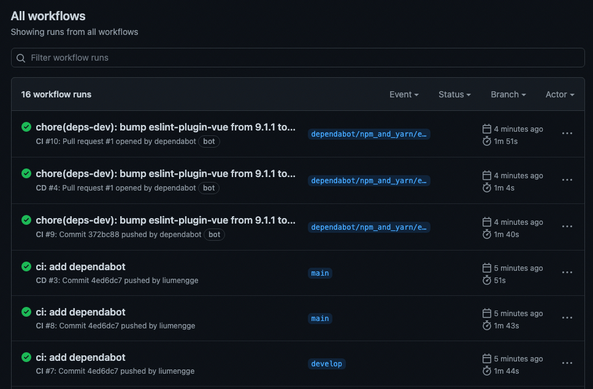

# engineered-configuration-demo

> 目前接触到的团队项目中后台管理系统像 webpack 的相关配置已经被大佬封装起来了，而且后台管理系统默认使用最新版 Chrome 浏览器，不做过多的兼容处理，所以项目中关于工程化配置的部分就比较轻量。前台项目中会看到非常多的工程化配置文件，然而这些配置文件在项目搭建阶段基本上已经被大佬们按需配置好了，做起需求来也并不涉及这些工程化配置。但是详细学习前端工程化还是很有必要的，如果接手团队中历史遗留的老项目需要去重构然后实现前后端分离，那这些工程化配置如何做能将前端项目拆分出来并实现前端独立打包构建部署？接下来，本篇文章就通过一个 demo 逐步学习下如何做一个比较完整的前端工程化配置。

## 项目初始化

1. demo 环境：node 14.18.1
2. Gihutb 创建 repo
3. clone 到本地，执行`npm init -y`初始化
4. 使用 ESM 规范，即 `package.json` 中设置 type 为 `module`
5. 安装ts相关依赖：`npm i typescript -D`
6. 执行`npx tsc --init`初始化 tsconfig.json

## tsconfig.json配置

刚初始化生成的 tsconfig.json 文件中会有很多注释的配置项，按需配置即可。
```json
{
  "compilerOptions": {
    /* Basic Options */
    "baseUrl": ".", // 模块解析根路径，默认为 tsconfig.json 位于的目录
    "rootDir": "src", // 编译解析根路径，默认为 tsconfig.json 位于的目录
    "target": "ESNext", // 指定输出 ECMAScript 版本，默认为 es5
    "module": "ESNext", // 指定输出模块规范，默认为 Commonjs
    "lib": ["ESNext", "DOM"], // 编译需要包含的 API，默认为 target 的默认值
    "outDir": "dist", // 编译输出文件夹路径，默认为源文件同级目录
    "sourceMap": true, // 启用 sourceMap，默认为 false
    "declaration": true, // 生成 .d.ts 类型文件，默认为 false
    "declarationDir": "dist/types", // .d.ts 类型文件的输出目录，默认为 outDir 目录
    /* Strict Type-Checking Options */
    "strict": true, // 启用所有严格的类型检查选项，默认为 true
    "esModuleInterop": true, // 通过为导入内容创建命名空间，实现 CommonJS 和 ES 模块之间的互操作性，默认为 true
    "skipLibCheck": true, // 跳过导入第三方 lib 声明文件的类型检查，默认为 true
    "forceConsistentCasingInFileNames": true, // 强制在文件名中使用一致的大小写，默认为 true
    "moduleResolution": "Node", // 指定使用哪种模块解析策略，默认为 Classic
  },
  "include": ["src"] // 指定需要编译的文件，默认当前目录下除了 exclude 之外的所有.ts, .d.ts,.tsx 文件
}
```

## package.json配置

```json
{
  "main": "dist/index.js",
  "types": "dist/types/index.d.ts", // 指定编译生成的类型文件，如果 compilerOptions.declarationDir 指定的是 dist，也就是源码和 .d.ts 同级，那么types可以省略
  "type": "module",
  "scripts": {
    "dev": "tsc --watch",
    "clean": "rm -rf dist",
    "build": "npm run clean && tsc"
  },
  "publishConfig": {
    "access": "public"
  },
}
```

现在验证下配置是否成功，index.ts:
```js
const testF = (a: number, b:number) => {
  return a - b
}

console.log(testF(1024, 28))
```

执行：`npm run build && node dist/index.js`，预期结果是在 dist 目录中生成 types/index.d.ts、index.js、index.js.map，并打印 996。

## Eslint & Prettier

> 使用 Prettier 解决代码格式问题，使用 Linters 解决代码质量问题，prettier-vscode 和 eslint-vscode 存在冲突，如何 prettier 和 eslint 集成？

### Eslint

1. 安装 eslint：`npm i eslint -D`
2. 利用 eslint 的命令行工具生成基本配置：`npx eslint --init`
3. 一路按照提示安装，控制台提示如下：
```
✔ How would you like to use ESLint? · problems
✔ What type of modules does your project use? · esm
✔ Which framework does your project use? · vue
✔ Does your project use TypeScript? · No / Yes
✔ Where does your code run? · browser
✔ What format do you want your config file to be in? · JavaScript
The config that you've selected requires the following dependencies:

eslint-plugin-vue@latest @typescript-eslint/eslint-plugin@latest @typescript-eslint/parser@latest
✔ Would you like to install them now? · No / Yes
✔ Which package manager do you want to use? · npm
```

可以看到生成的`.eslintrc.cjs` 文件：
```js
module.exports = {
  "env": {
    "browser": true,
    "es2021": true,
    "node": true
  },
  "extends": [
    "eslint:recommended",
    "plugin:vue/vue3-essential",
    "plugin:@typescript-eslint/recommended"
  ],
  "parserOptions": {
    "ecmaVersion": "latest",
    "parser": "@typescript-eslint/parser",
    "sourceType": "module"
  },
  "plugins": [
    "vue",
    "@typescript-eslint"
  ],
  "rules": {
  }
}
```

> 为什么生成的配置文件后缀是`.cjs`而不是`.js`？
> 因为项目使用了ESM规范，`npx eslint --init`会自动识别 type，并生成兼容的配置文件名称，如果改回 .js 结尾，再尝试运行 eslint 会报错。出现这个现象是因为 eslint 内部使用了`require()`读取配置。这个情况也适用于其他功能的配置，比如后面的 Prettier、Commitlint等，配置文件都不能以 xx.js 结尾，而要改为当前库支持的其他配置文件格式，如：`.xxrc、.xxrc.json、.xxrc.yml`。

验证配置是否成功，index.ts：
```js
const testF = (a: number, b:number) => {
  return a - b
}

// console.log(testF(1024, 28))
```

package.json:
```json
"scripts": {
  "dev": "tsc --watch",
  "clean": "rm -rf dist",
  "build": "npm run clean && tsc",
  "lint": "eslint src --ext .js,.ts --cache --fix"
},
```

执行`npm run lint`：
```
/Users/xxx/Desktop/learn&share/engineered-configuration-demo/src/index.ts
  1:7  warning  'testF' is assigned a value but never used  @typescript-eslint/no-unused-vars

✖ 1 problem (0 errors, 1 warning)
```
检测成功。

### Prettier

> 把 prettier 集成到 eslint 的校验中

1. 安装依赖：`npm i prettier -D`
2. 创建基础配置文件：`echo {}> .prettierrc.json`

.prettierrc.json中只需要添加和所选规范冲突的部分
```js
{
  "semi": false, // 是否使用分号
  "singleQuote": true, // 使用单引号代替双引号
  "trailingComma": "none" // 多行时尽可能使用逗号结尾
}
```

3. 安装解决冲突需要的2个依赖：`npm i eslint-config-prettier eslint-plugin-prettier -D`
   1. eslint-config-prettier：关闭可能与 prettier 冲突的规则
   2. eslint-plugin-prettier：使用 prettier 代替 eslint 格式化

.eslintrc.cjs:
```js
module.exports = {
  // ...
  "plugins": [
    "vue",
    "@typescript-eslint",
    "prettier"
  ],
  "rules": {
    "prettier/prettier": "error"
  }
}
```

`npm run lint`

## Husky

> 什么是 Git Hooks？是可以设置在 Git 生命周期的在某些事件下运行的脚本。这些事件包括提交的不同阶段，例如在提交之前（pre-commit），提交之后（post-commit）。这些功能非常有用，因为它们允许开发人员运行自定义代码任务，甚至运行其他自动化脚本来执行合适的代码规范及标准。

> Husky 是干嘛的？一个项目通常是团队合作，项目中虽然配置了 Eslint 和 Prettier 但是不能保证每个开发者都能在提交代码之前执行一遍 lint 校验，为了加强团队代码规范，可以借助 Husky + git hooks 来自动化校验，校验不通过时禁止提交。

1. 安装 husky：`npm i husky -D`
2. 生成 .husky：`npx husky install`，在每次执行`npm install`时会自动启用 husky
3. package.json中添加husky：
```json
"scripts": {
  // ...
  "prepare": "husky install"
}
```
3. 添加一个 lint 钩子：`npx husky add .husky/pre-commit "npm run lint"`

也可以直接在 .husky/pre-commit 文件中写入如下内容：
```sh
#!/usr/bin/env sh
. "$(dirname -- "$0")/_/husky.sh"

npm run lint
```
表示在commit之前执行lint操作。

4. 测试是否生效，修改 index.ts 文件内容：
```js
const testF = (a: number, b: number): number => {
  return a - b
}

// console.log(testF(1024, 28))
```

执行 commit：
```
git add .
git commit -m 'test husky'
```
会看到控制台有如下提示信息：
```
/Users/xxx/Desktop/learn&share/engineered-configuration-demo/src/index.ts
  1:7  warning  'testF' is assigned a value but never used  @typescript-eslint/no-unused-vars

✖ 1 problem (0 errors, 1 warning)
```
warning，可以commit的。。。

如何可以调整为error？可以修改下 eslintrc.cjs 规则：
```json
"rules": {
  "prettier/prettier": "error",
  "@typescript-eslint/no-unused-vars": ["error"]
}
```
此时控制台提示信息为：
```
/Users/xxx/Desktop/learn&share/engineered-configuration-demo/src/index.ts
  1:7  error  'testF' is assigned a value but never used  @typescript-eslint/no-unused-vars

✖ 1 problem (1 error, 0 warnings)
```

现在控制台提示的是error而不是warning。再重试下commit，此时会有error提示在控制台并拦截掉commit。

## Commitlint

> 不是已经有Husky把关了吗，为啥需要 Commitlint ？有啥区别？
> Commitlint 的作用主要是有利于在生成 changelog 文件和语义发版中需要提取 commit 信息，另一方面也有利于其他同学分析自己提交的代码

1. 安装 Commitlint：`npm i @commitlint/config-conventional @commitlint/cli -D`

- `@commitlint/config-conventional`：是基于 Angular 的约定规范
- `@commitlint/cli`：Commitlint 命令行工具

2. 将 commitlint 添加到钩子：`npx husky add .husky/commit-msg 'npx --no-install commitlint --edit "$1"'`
3. 创建 `.commitlintrc` ：
```js
{
  "extends": [
    "@commitlint/config-conventional"
  ]
}
```
4. 测试钩子是否生效，index.ts:
```js
const testF = (a: number, b: number) => {
  return a - b
}

console.log(testF(1024, 28))
```

当前后台管理系统开发 commit 规范并没有被引入进来，完成需求后commit的信息是根据个人喜好来的。比如：
```sh
git add .
git commit -m 'add eslint and commitlint'
```

规范：
```sh
git commit -m 'ci: add eslint and commitlint'
```

ci是啥？Angular 规范中的相关内容：
- feat：新功能
- fix：修补 BUG
- docs：修改文档，比如 README, CHANGELOG, CONTRIBUTE 等等
- style：不改变代码逻辑 (仅仅修改了空格、格式缩进、逗号等等)
- refactor：重构（既不修复错误也不添加功能）
- perf：优化相关，比如提升性能、体验
- test：增加测试，包括单元测试、集成测试等
- build：构建系统或外部依赖项的更改
- ci：自动化流程配置或脚本修改
- chore：非 src 和 test 的修改，发布版本等
- revert：恢复先前的提交


## Jest

> 测试覆盖率100%！

1. 安装 jest 和 类型声明 @types/jest，以及执行需要的 ts-node 和 ts-jest：`npm i jest @types/jest ts-node ts-jest -D`
2. 初始化配置文件：`npx jest --init`，一路操作之后：
```
✔ Would you like to use Jest when running "test" script in "package.json"? … yes
✔ Would you like to use Typescript for the configuration file? … yes
✔ Choose the test environment that will be used for testing › node
✔ Do you want Jest to add coverage reports? … yes
✔ Which provider should be used to instrument code for coverage? › babel
✔ Automatically clear mock calls, instances, contexts and results before every test? … yes
```
3. package.json加入test:
```json
"scripts": {
  // ...
  "test": "jest"
},
```
4. 修改生成的 jest.config.ts 文件：
```js
{
  preset: 'ts-jest'
}
```

5. 创建测试目录 `__tests__` 和 测试文件 `__tests__/testF.spec.ts`。
6. 测试配置是否生效:
```js
// index.ts
const testF = (a: number, b: number) => {
  return a - b
}

export default testF
```

testF.spec.ts 文件中写入测试代码：
```js
import testF from '../src'

test('The result should be 996', () => {
  expect(testF(1024, 28)).toBe(996)
})
```
控制台执行`npm run test`测试配置是否生效：


执行完后会生成一个coverage目录，其中包含有测试报告。

7. 给 `__test__` 目录加上 lint 校验

修改package.json：
```js
"scripts": {
  // ...
  "lint": "eslint src __tests__ --ext .js,.ts --cache --fix",
},
```

此时，直接执行 `npm run lint` 将会报错，提示 `__tests__` 文件夹没有包含在 `tsconfig.json` 的 `include` 中，若添加到 include，输出的 dist 中就会包含测试相关的文件，实际上 dist 目录中并不需要测试文件。可以使用`typescript-eslint`官方给出的解决方案：

新建一个 tsconfig.eslint.json 文件：
```json
{
  "extends": "./tsconfig.json",
  "include": ["**/*.ts", "**/*.js"]
}
```

.eslintrc.cjs：
```js
"project": "./tsconfig.eslint.json"
```

验证配置是否生效：
```
git add .
git commit -m 'test: add unit test'
```
dist 目录中未包含测试代码，配置可正常生效。
## Gihub Actions

> 通过 Github Actions 实现代码合并或推送到主分支，dependabot机器人升级依赖等动作，会自动触发测试和发布版本等一系列流程

### 代码自动测试

项目根目录创建 `.github/workflows/ci.yml` 及 `.github/workflows/cd.yml`，

ci.yml: 持续集成
```yml
name: CI

on:
  push:
    branches:
      - '**'
  pull_request:
    branches:
      - '**'
jobs:
  linter:
    runs-on: ubuntu-latest
    steps:
      - uses: actions/checkout@v2
      - uses: actions/setup-node@v2
        with:
          node-version: 16
      - run: npm ci
      - run: npm run lint
  tests:
    needs: linter
    runs-on: ubuntu-latest
    steps:
      - uses: actions/checkout@v2
      - uses: actions/setup-node@v2
        with:
          node-version: 16
      - run: npm ci
      - run: npm run test
```
监听所有分支的 push 和 PR 动作，自动执行 linter 和 tests 任务。接下来，测试配置是否生效：
```
git add .
git commit -m 'ci: use github actions'
git push
```

在 repo 的 github 的 Actions 可以看到对应的工作流程：


以上完成了代码自动 lint 和 测试 流程，如何实现自动发布？

### 代码自动发布

1. [NPM](https://www.npmjs.com/) 官网注册一个账号，注册流程比较常规，这里不贴详细内容了，记录下自己的name、password、email，后续 npm login 的时候会用
2. 创建一个package

创建一个目录 milly-first-npm, cd 进去，创建index.js随便写点啥,，比如：
```js
console.log('This is my first npm!')
```
执行`npm init -y`进行初始化。

`npm login`输入name、password、email以及one-time password后, 执行`npm publish`控制台出现如下报错：
```
npm ERR! code E403
npm ERR! 403 403 Forbidden - PUT https://registry.npmjs.org/my-first-npm - You do not have permission to publish "my-first-npm". Are you logged in as the correct user?
npm ERR! 403 In most cases, you or one of your dependencies are requesting
npm ERR! 403 a package version that is forbidden by your security policy.
```

原因是包名重复，改下包名重新发布，控制台提示信息如下：
```
npm notice name:          milly-first-npm                         
...
+ milly-first-npm@1.0.0
```
表示发布成功。

再到npm官网就可以看到发布的第一个package了：


3. [创建 GH_TOKEN](https://docs.github.com/en/authentication/keeping-your-account-and-data-secure/creating-a-personal-access-token)：
权限选择 repo 和 workflow 权限


4. [创建 NPM_TOKEN](https://docs.npmjs.com/creating-and-viewing-access-tokens)：权限类型选择 Automation


5. 将 GH_TOKEN 和 NPM_TOKEN 添加到 repo 的 Actions secrets 中


6. 创建 持续部署配置文件 cd.yml

```yml
name: CD

on:
  push:
    branches:
      - main  // 项目主分支为 main
  pull_request:
    branches:
      - main
jobs:
  release:
    runs-on: ubuntu-latest
    steps:
      - uses: actions/checkout@v2
      - uses: actions/setup-node@v2
        with:
          node-version: 16
      - run: npm ci --ignore-scripts
      - run: npm run build
      - run: npx semantic-release
        env:
          GH_TOKEN: ${{ secrets.GH_TOKEN }}
          NPM_TOKEN: ${{ secrets.NPM_TOKEN }}
```

6. 安装语义版本及其相关插件：`npm i semantic-release @semantic-release/changelog @semantic-release/git -D`
- `semantic-release`：语义发版核心库
- `@semantic-release/changelog`：用于自动生成changelog
- `@semantic-release/git`：将发布时产生的更改提交回远程仓库

7. 根目录下创建 .releaserc 文件

```json
{
  "branches": ["+([0-9])?(.{+([0-9]),x}).x", "main"], // github repo 的主分支为 main
  "plugins": [
    "@semantic-release/commit-analyzer",
    "@semantic-release/release-notes-generator",
    "@semantic-release/changelog",
    "@semantic-release/github",
    "@semantic-release/npm",
    "@semantic-release/git"
  ]
}
```
8. 创建分支 develop 并提交内容

```sh
git checkout -b develop
git add .
git commit -m 'feat: complete the CI/CD workflow'
git push --set-upstream origin develop
git push
```

将 develop 分支合并到主分支：
```sh
git checkout main
git merge develop
git push
```
该提交会自动触发 测试 并 发布版本，自动创建 tag 和 changelog，可以看到 Github 主页和 NPM package 主页都有相关发布：


NPM上的 package 包名称与项目 package.json 中 name 一致。

9. 切回 develop 分支，创建一个自动更新依赖的workflow：dependabot.yml
```yml
version: 2
updates:
  # Enable version updates for npm
  - package-ecosystem: 'npm'
    # Look for `package.json` and `lock` files in the `root` directory
    directory: '/'
    # Check the npm registry for updates every day
    schedule:
      interval: 'daily'
```

提交并查看 workflows 是否全部通过，再合并到 主分支 并提交(这个提交不会触发版本发布)：
```sh
git pull origin main
git add .
git commit -m 'ci: add dependabot'
git push 

git checkout main
git merge develop
git push
```


那什么情况下是可以触发的？
- push 和 PR 到主分支上时触发版本发布
- commit 前缀为feat、fix、perf会触发发布，否则跳过

## 知识拓展

1. `nvm、npm、cnpm、npx、pnpm` 之间是什么关系和区别？分别是在什么场景下使用的？

包管理工具发展史：

小结：
- nvm：Node 版本管理工具
- npm：Node 内置的包管理工具
- cnpm：npm 从国外服务器下载安装依赖包，网络不好很容易失败，cnpm是 npmjs.org 的国内镜像源，通过` npm install -g cnpm --registry=https://registry.npm.taobao.org`安装，使用方式跟 npm 一样
- npx：npm 5.2版本新增的一个执行命令，详细内容参考[npx使用教程](http://www.ruanyifeng.com/blog/2019/02/npx.html)
- pnpm：支持 Monorepo 的现代包管理工具，集成了 npm 和 yarn 的优点

[pnpm benchmarks](https://pnpm.io/zh/benchmarks)


2. `npm run dev` 做了什么？


3. 在 Github Actions 最开始就出现了 `dependabot机器人升级依赖` 的字样，所以，Dependabot 是什么？干什么的？首先，在 repo 的 Setting-Security 部分可以找到 Dependabot：


里面有详细的文档去解释什么是Dependabot。我觉得简单理解就是在做check，主要提供以下3项能力：
- Detection of vulnerable dependencies send Dependabot alert：Dependabot 会检测 vulnerable dependencies，如果有就发出 Dependabot alert，就是下图提示的这样: 该项检测被触发的情况有3种：
  - [GitHub Advisory Database](https://github.com/advisories) 新增 vulnerability 时会被触发(GitHub Advisory Database 是 Github 提供的一个用于开源项目漏洞检测的页面)
  - WhiteSource Database 中有 vulnerability 新增时被触发 (WhiteSource DB 与 GitHub Advisory DB 类似）
  - repo 中添加了新的依赖，或者升级了某一个依赖的版本，或者依赖图发生了改变时被触发
- Stop using vulnerable dependencies and keep security updates: 这是启用 Dependabot security updates 后提供的能力，会找到没有漏洞的版本将漏洞修复掉然后给 repo 提一个PR，以实现自动 security updates。如果要实现自动修复，除了要在 Github 将 Dependabot security updates 功能 enable，还需要在项目的`.github/dependabot.yml`中制定配置项，主要指定哪些漏洞需要自动修复以及多久执行一次自动修复(参照上述 dependabot.yml 配置的内容)。
- Keep all your dependencies updated：Dependabot 除了可以处理漏洞，还可以检测所使用的依赖中是否有可以更新的版本，如果有，就实现自动更新，所以在 repo 中启用了 Dependabot 之后，就可以保证 repo 中使用的依赖都是最新的。

3. 在整个配置过程中有多次提到 PR，到底什么是 PR ？